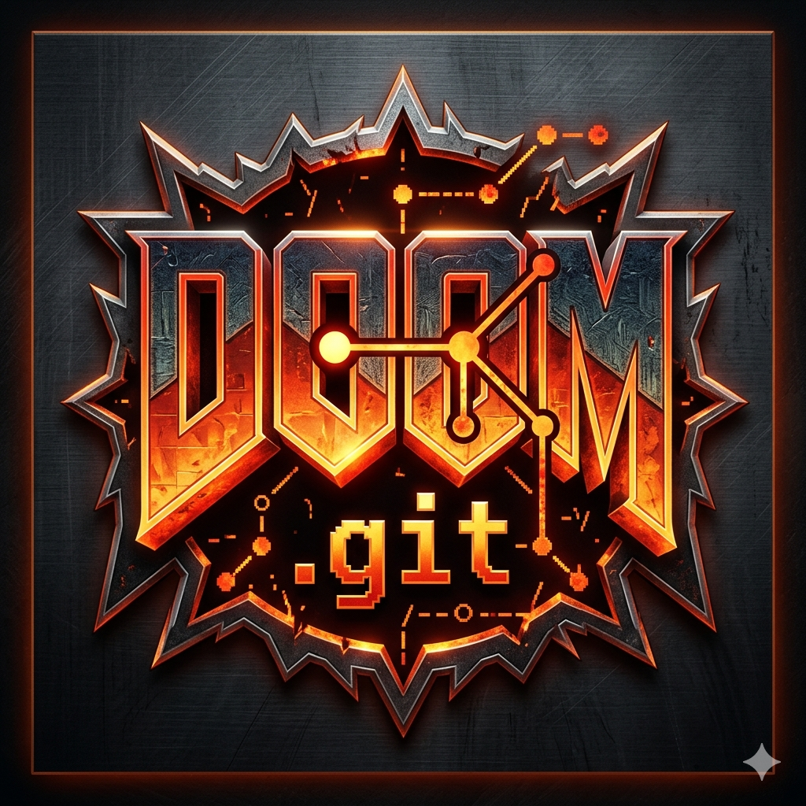

<p align="center">
  
</p>

<h1 align="center">DOOM.git</h1>

<p align="center">
  <strong>Every frame of DOOM is a git commit.<br>Your death is in the git log.<br>You can <code>git bisect</code> to find exactly when you got hit.</strong>
</p>

<p align="center">
  <a href="#quick-start"></a>
  <a href="https://github.com/Abdelrhman-Official/doomgit/stargazers"></a>
  <a href="LICENSE"></a>
  <a href="https://github.com/Abdelrhman-Official/doomgit/issues"></a>
</p>

<p align="center">
  <!-- Replace with your asciinema recording ID -->
  <a href="https://asciinema.org/a/PLACEHOLDER">
    
  </a>
  <br>
  <sub>▲ 60-second demo: play DOOM → inspect git log → rewind your death</sub>
</p>

---

## 🤯 Why This Is Insane

You play DOOM. Behind the scenes, **every single frame** becomes a git commit — complete with an ASCII render of the screen and full game state (health, ammo, position, kills).

That means you can:

- **`git log`** your entire playthrough — with inline ASCII frame previews
- **`git bisect`** to find the *exact commit* where you first took damage
- **`git diff HEAD~100..HEAD`** to see how a fight played out
- **`git branch save/before-boss`** to create a save state
- **Share your playthrough** — it's just a git repo. Push to GitHub.

```
$ doomgit log

commit a4f2b91  frame 4521 | E1M1 | health:72 kills:3
  ................................................................................
  ......########......################################################............
  ......#      #......#                                              #............
  ......# DOOM #......#         [player here] ---->                  #............
  ......#      #......#                                              #............
  ......########......################################################............
  ................................................................................

commit a4f2b90  frame 4520 | E1M1 | health:85 kills:2
  ...
```

---

## 🔍 `doomgit bisect` — Find Your Death

```bash
# Find the exact frame where your health dropped below 50
$ doomgit bisect --when "health < 50"

Bisecting: 2048 commits left to test
[commit a3c1f2e] frame 2301 | E1M3 | health:49 | kills:12
^ This is the commit where you got hit by an imp fireball
  Binary search through 4096 commits in just 12 steps
```

> Every developer who sees this loses their mind.

---

## ⚡ Quick Start

<a id="quick-start"></a>

```bash
# 1. Clone & install
git clone https://github.com/Abdelrhman-Official/doomgit.git
cd doomgit && pip install -e .

# 2. Build the engine + init the game repo
doomgit init

# 3. Play DOOM — every frame is now a git commit
doomgit play
```

> **Requirements:** Python 3.11+, CMake, SDL2, libgit2. See [full setup guide](#setup) below.

---

## 🎮 Commands

| Command | What it does |
|---|---|
| `doomgit init` | Initialize game repo + compile the engine |
| `doomgit play` | Launch DOOM — frames auto-commit in background |
| `doomgit pause` | Pause committing (engine keeps running) |
| `doomgit rewind [N]` | Go back N frames, replay in terminal |
| `doomgit forward [N]` | Replay N frames forward |
| `doomgit save <name>` | Create a named save (git branch) |
| `doomgit load <name>` | Load a save state |
| `doomgit log` | Git log with inline ASCII frame previews |
| `doomgit stats` | Player stats from commit history |
| `doomgit share` | Push your playthrough to GitHub |
| `doomgit spectate <url>` | Clone + replay someone else's game |
| `doomgit bisect` | Binary search for when something happened |

---

## 🏗️ How It Works

```
┌──────────────┐     shared memory      ┌──────────────┐     pygit2      ┌──────────────┐
│              │  ──────────────────►    │              │  ────────────►  │              │
│  Chocolate   │   pixel buffer +       │    Frame     │   create blob   │   Git Repo   │
│    Doom      │   game state           │   Daemon     │   build tree    │  (game/.git) │
│  (engine)    │                        │  (Python)    │   write commit  │              │
│              │  ◄── UNIX signals ──   │              │                 │              │
└──────────────┘                        └──────────────┘                 └──────────────┘
                                              │
                                        ASCII renderer
                                        (80×24 chars)
```

Three decoupled processes:

1. **Game Engine** — Chocolate Doom with a 4-line hook that writes pixels to shared memory
2. **Frame Daemon** — Python process that reads pixels, renders ASCII, commits to git (~5ms per commit)
3. **CLI** — User-facing commands that manipulate the repo (`rewind`, `save`, `bisect`, etc.)

> 📐 **Deep dive:** [ARCHITECTURE.md](ARCHITECTURE.md) — full technical breakdown with code examples

### Performance

| Metric | Value |
|---|---|
| Commit speed | ~5ms via pygit2 (no shell, no subprocess) |
| Commit rate | 12 commits/sec (every 3rd game tick) |
| Storage per frame | ~80 bytes after git delta compression |
| 1 hour of play | ~3.5 MB packed — fits in any GitHub repo |

---

## 🛠️ Setup

<a id="setup"></a>

### Prerequisites

<details>
<summary><strong>Ubuntu / Debian</strong></summary>

```bash
sudo apt update
sudo apt install -y build-essential cmake libsdl2-dev libsdl2-mixer-dev \
  libsdl2-net-dev libpng-dev python3-dev libgit2-dev
pip install pygit2 typer rich
```
</details>

<details>
<summary><strong>macOS (Homebrew)</strong></summary>

```bash
brew install cmake sdl2 sdl2_mixer sdl2_net libpng libgit2
pip install pygit2 typer rich
```
</details>

<details>
<summary><strong>Arch Linux</strong></summary>

```bash
sudo pacman -S cmake sdl2 sdl2_mixer sdl2_net libpng libgit2 python-pygit2
pip install typer rich
```
</details>

### Build from Source

```bash
git clone https://github.com/Abdelrhman-Official/doomgit.git
cd doomgit

# Build the engine
make build

# Install the Python CLI
pip install -e .

# Download the free DOOM WAD (if not bundled)
make wad

# Play!
doomgit init
doomgit play
```

### Troubleshooting

| Problem | Solution |
|---|---|
| `libgit2 not found` | Install `libgit2-dev` (apt) or `libgit2` (brew) |
| `SDL2 not found` | Install `libsdl2-dev` (apt) or `sdl2` (brew) |
| `pygit2` install fails | Ensure `libgit2-dev` is installed first |
| Engine won't compile | Run `make clean && make build` |
| No WAD file | Run `make wad` or download `freedoom1.wad` manually |

---

## 🤝 Contributing

We'd love your help! Check out [CONTRIBUTING.md](CONTRIBUTING.md) for guidelines.

**Good first issues:**
- [ ] Add `--color` flag for ANSI 256-color ASCII output
- [ ] Implement `doomgit diff` to show side-by-side frame comparison
- [ ] Add Unicode block character mode (`█▓▒░`) for hi-res output
- [ ] Create GitHub Actions workflow for CI
- [ ] Write unit tests for ASCII renderer

---

## 🌍 Community Playthroughs

> Push your playthrough to GitHub and open a PR to add it here!

| Player | Level | Commits | Link |
|---|---|---|---|
| *Be the first!* | — | — | — |

---

## 📄 License

MIT — see [LICENSE](LICENSE). The engine fork (Chocolate Doom) remains under GPL-2.0.

---

<p align="center">
  <strong>If you think this is as insane as we do, smash that ⭐ button.</strong>
  <br><br>
  <a href="https://github.com/Abdelrhman-Official/doomgit">
    
  </a>
</p>
